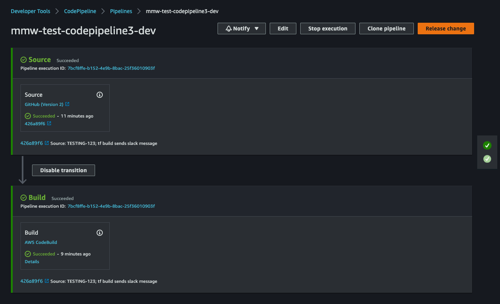
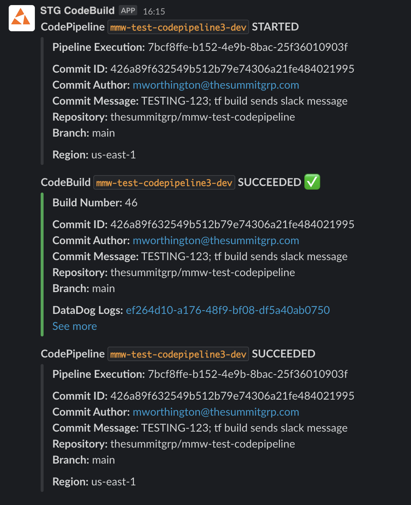

<h1 align="center">devops-infra-aws-tf-codepipeline</h1>

<div align="center">

[](https://github.com/Lenders-Cooperative/devops-infra-aws-tf-codepipeline/releases)
[](https://github.com/Lenders-Cooperative/devops-infra-aws-tf-codepipeline/issues)
[](https://github.com/Lenders-Cooperative/devops-infra-aws-tf-codepipeline/pulls)
[](LICENSE)

</div>

# About

Terraform code to create AWS CodeBuild and CodePipeline along with a Lambda function to send Slack alerts.

This repository contains two modules:

1. [codebuild_scaffold](modules/codebuild_scaffold/) - will create resources that are needed once per region, for example, the lambda function to send the slack message
2. [codebuild](modules/codebuild/) - call this module for each AWS CodeBuild project that you want to create

This module supports configuring a web hook to trigger [AWS CodeBuild](https://docs.aws.amazon.com/codebuild/latest/userguide/welcome.html). We encountered two problems with the web hook trigger: 

* when builds run concurrently, they can run out of order, so latest commit could be superceeded by older commit
* when concurrency is set to 1, the builds are not queued, so latest commits are not built

To resolve these issues, we replced the web hook trigger with [AWS CodePipeline](https://docs.aws.amazon.com/codepipeline/latest/userguide/welcome.html) using GitHub v2 CodeStar Connection.

# Demo

For each call to the [codebuild module](modules/codebuild/), an [AWS CodeBuild](https://docs.aws.amazon.com/codebuild/latest/userguide/welcome.html) project will be created and, optionally, added to an [AWS CodePipeline](https://docs.aws.amazon.com/codepipeline/latest/userguide/welcome.html) using the same configuration for the source connection.

<div style="width:400px ; height:300px; margin:0 auto">



</div>

If the `slack_notification_channel` variable is passed to the [codebuild module](modules/codebuild/), SNS Notifications are set up for the CodeBuild and CodePipeline using the channel as defined in the variable's value. The Slack App's OAuth Token needs to be passed in the `slack_token` variable in the [codebuild_scaffold module](modules/codebuild_scaffold/).

<div style="width:400px ; height:500px; margin:0 auto">



</div>

<br>

# Usage

To import to your Terraform project as a remote module:

1. Add SSH key for a user that has access to this remote repository

2. Reference the module (NOTE: set `ref` to the tag to install)

    create only one scaffold:

    ```Terraform
    module "codebuild-scaffold" {
      source = "git@github.com:Lenders-Cooperative/devops-infra-aws-tf-codepipeline.git//modules/codebuild_scaffold?ref=0.9"

      ...
    }
    ```

    create as many builds as you need:

    ```Terraform
    module "codebuild-main" {
      source = "git@github.com:Lenders-Cooperative/devops-infra-aws-tf-codepipeline.git//modules/codebuild?ref=0.9"

      ...
    }

    module "codebuild-featurebranch" {
      source = "git@github.com:Lenders-Cooperative/devops-infra-aws-tf-codepipeline.git//modules/codebuild?ref=0.9"

      ...
    }
    ```


3. `terraform init`

4. Set Terraform Variables

    * [modules/codebuild/variables.tf](modules/codebuild/variables.tf)
    * [modules/codebuild_scaffold/variables.tf](modules/codebuild_scaffold/variables.tf)

5. `terraform apply`

# Contributing

Contributions, issues and feature requests are welcome.

Check the [issues page](https://github.com/Lenders-Cooperative/devops-infra-aws-tf-codepipeline/issues) for known defects and enhancements. Submit a [pull request](https://github.com/Lenders-Cooperative/devops-infra-aws-tf-codepipeline/pulls) to contribute your changes.

# Copyright

Copyright © 2022, [Lenders Cooperative](https://lenderscooperative.com/), a division of [Summit Technology Group, Inc.](https://thesummitgrp.com/)

# License

This project is provided under the [Apache 2.0 license](LICENSE)


# Acknowledgements

Forked from [Cloud Posse, LLC - terraform-aws-codebuild 1.0.0](https://github.com/cloudposse/terraform-aws-codebuild/releases/tag/1.0.0)

Initial modifications:

* disabled S3 bucket versioning
* added AWS Region name to resources to support DR
* added the ability to create a CodeBuild Web Hook
* added the ability to create a CodePipeline and add the CodeBuild as a Build step
* added CodeStar Notification Rules for SNS+Lambda to send Slack notifications

# Contributors

<a href = "https://github.com/Lenders-Cooperative/devops-infra-aws-tf-codepipeline/graphs/contributors">
   
</a>
